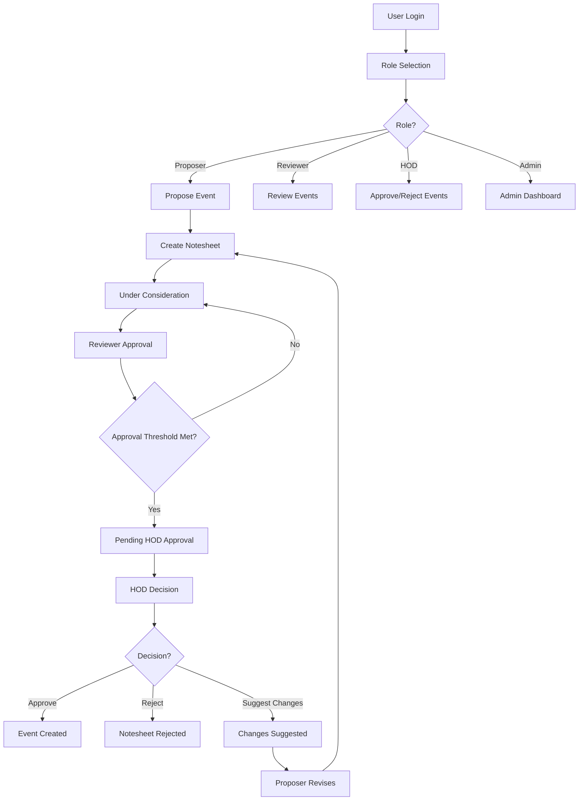
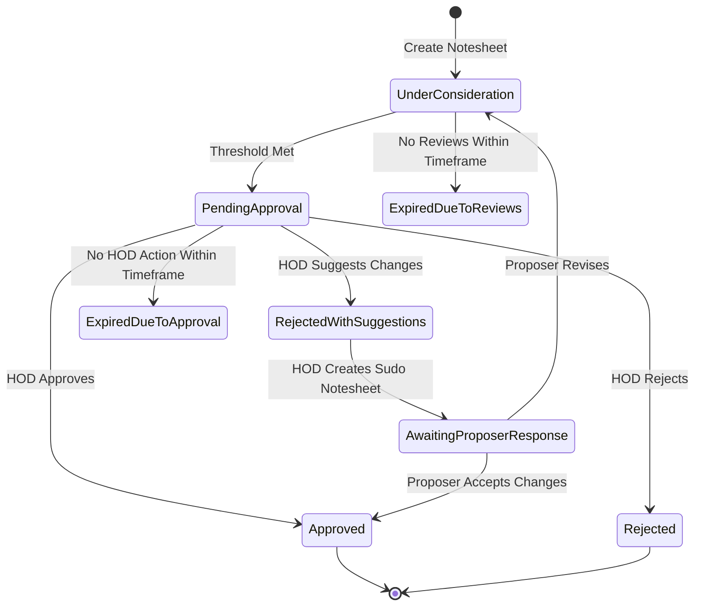
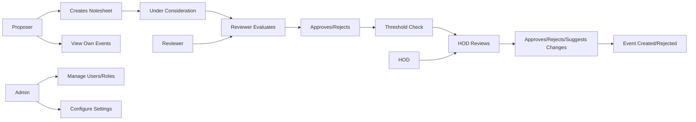

# Notesheet Tracker

A Flutter application for managing event proposals through a notesheet system with role-based access control. The app streamlines the event approval process by allowing proposers to submit event details, reviewers to provide feedback, and HODs to make final approval decisions.

## Table of Contents
- [Features](#features)
- [Architecture](#architecture)
- [Workflow Diagrams](#workflow-diagrams)
- [Setup Instructions](#setup-instructions)
- [User Roles](#user-roles)
- [Project Structure](#project-structure)

## Features

- **Role-Based Access Control**: Different permissions for Admins, Proposers, Reviewers, and HODs
- **Event Proposal System**: Proposers can submit detailed event proposals with all necessary information
- **Review Process**: Reviewers can evaluate and approve/reject event proposals
- **HOD Approval**: HODs have final approval authority and can suggest changes
- **Real-time Updates**: Firebase integration for real-time data synchronization
- **Dashboard Views**: Customized dashboards for each user role
- **Event Management**: Track events from proposal to completion
- **User Management**: Admin can manage user roles and settings

## Architecture

The application follows a clean architecture pattern with:

- **Presentation Layer**: Flutter UI components and screens
- **Business Logic Layer**: Services managing the app's core functionality
- **Data Layer**: Firebase services for authentication and Firestore database
- **Dependency Injection**: Using `get_it` for service locator pattern

### Key Components

- **Models**: Data structures for `User`, `Notesheet`, and `Event`
- **Services**: Business logic for authentication, notesheet management, event management
- **Screens**: Role-specific dashboards and forms
- **Widgets**: Reusable UI components

## Workflow Diagrams

### Overall System Flow


### Notesheet Status Flow


### User Role Interactions


## Setup Instructions

### Prerequisites
- Flutter SDK (3.8.1 or higher)
- Dart SDK (3.8.1 or higher)
- Firebase account
- Android Studio or VS Code with Flutter plugin

### Installation

1. **Clone the repository:**
   ```bash
   git clone <repository-url>
   cd notesheet_tracker
   ```

2. **Install dependencies:**
   ```bash
   flutter pub get
   ```

3. **Set up Firebase:**
   - Create a new Firebase project at [Firebase Console](https://console.firebase.google.com/)
   - Add an Android, iOS, and Web app to your Firebase project
   - Download the configuration files (`google-services.json` for Android, `GoogleService-Info.plist` for iOS)
   - Place the configuration files in the appropriate directories:
     - Android: `android/app/google-services.json`
     - iOS: `ios/Runner/GoogleService-Info.plist`
     - Web: Update `lib/firebase_options.dart` with your web config

4. **Configure Firebase Firestore:**
   - Enable Firestore in your Firebase project
   - Set up the security rules (see `firestorerule.md` for reference)
   - Create indexes as needed for your queries

5. **Run the application:**
   ```bash
   flutter run
   ```

### Firebase Security Rules

The application uses the following Firestore security rules (see `firestorerule.md`):

- Users can only read/write their own profiles
- Admins have full access to all data
- Proposers can create and manage their own notesheets
- Reviewers can read and update notesheets in review
- HODs can approve/reject notesheets and suggest changes

## User Roles

### Admin
- Manage users and their roles
- Configure system settings (approval thresholds)
- View all notesheets and events
- Access comprehensive dashboards with analytics

### Proposer
- Submit new event proposals
- View status of their proposals
- Edit proposals that have been rejected with suggestions
- View upcoming and past events

### Reviewer
- Review notesheets in "under consideration" status
- Approve or reject notesheets
- Provide feedback to proposers
- Track their review activities

### HOD (Head of Department)
- Approve/reject notesheets pending approval
- Suggest changes to notesheets
- Have final authority on event approvals
- Access to all events and notesheets

## Project Structure

```
lib/
├── app.dart              # App routes and route definitions
├── main.dart             # Main app entry point with authentication flow
├── firebase_options.dart # Firebase configuration
├── models/               # Data models (User, Notesheet, Event)
├── screens/              # UI screens organized by function
│   ├── login.dart        # Login screen
│   ├── register.dart     # Registration screen
│   ├── role_selector_screen.dart # Role selection
│   └── dashboard/        # Role-specific dashboards
├── services/             # Business logic services
├── utils/                # Utilities and helpers
└── widgets/              # Reusable UI components
```

Each user role has its own dashboard with relevant functionality:
- Admin Dashboard: User management, settings configuration, system overview
- Proposer Dashboard: Event proposal form, status tracking, event browsing
- Reviewer Dashboard: Review queue, review history
- HOD Dashboard: Approval queue, event management, decision tools

## Technologies Used

- **Flutter**: Cross-platform mobile development framework
- **Firebase**: Backend services (Authentication, Firestore)
- **Cloud Firestore**: NoSQL database for storing app data
- **Firebase Authentication**: User authentication
- **Provider**: State management
- **Get It**: Service locator for dependency injection
- **Intl**: Internationalization and localization

## Contributing

1. Fork the repository
2. Create a feature branch (`git checkout -b feature/amazing-feature`)
3. Commit your changes (`git commit -m 'Add amazing feature'`)
4. Push to the branch (`git push origin feature/amazing-feature`)
5. Open a Pull Request

## License

This project is licensed under the MIT License - see the LICENSE file for details.
